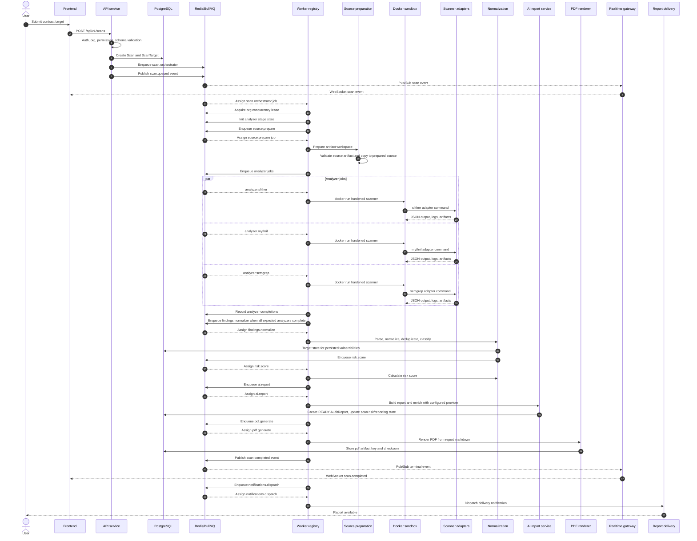
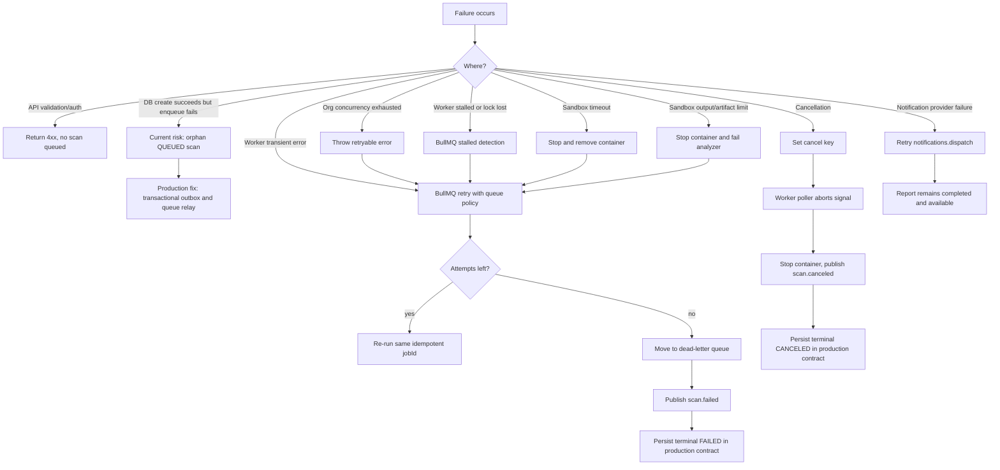

# End-to-End Scan Lifecycle

This document describes the scan path from user submission through report delivery. It is grounded in the current API, BullMQ worker, Redis realtime, local artifact store, and sandbox execution code.

## Sequence Flow



## Lifecycle Steps

1. User submits contract

The frontend sends a scan creation request to `POST /api/v1/scans`. Supported target shapes are `ADDRESS`, `SOURCE`, `REPOSITORY`, and `BYTECODE`. Local end-to-end execution currently works best with `SOURCE` plus an `artifactKey` that points inside `.artifacts`.

2. Validation

The API applies JWT or API-key auth, organization membership checks, permission checks, rate limits, and Zod request validation. Required permission for creation is `scans:create`. The request must include `organizationId`, priority, target details, and at least one analyzer.

3. Queue creation

`ScansRepository.create` writes `Scan` and `ScanTarget` records in PostgreSQL. `ScanQueueProducer.enqueue` adds `scan.orchestrator` to BullMQ with `jobId = scan:<scanId>:orchestrator`, priority mapping, 3 attempts, exponential backoff, and retention rules. The API publishes the first `scan.queued` event to Redis state, Redis timeline, and Redis Pub/Sub.

4. Worker assignment

Worker instances register one BullMQ worker per queue. On assignment, `WorkerRegistry.runWithGuards` acquires an organization concurrency lease, starts cancellation polling, joins the worker heartbeat, applies queue timeout policy, and passes a guarded processor context to the queue processor.

5. Sandbox execution

Analyzer processors call `ContainerizedScannerExecutionService.execute`. It resolves the prepared source artifact, creates an isolated temp output workspace, discovers Solidity targets, builds an analyzer command, and calls `ContainerSandboxExecutor`.

Sandbox hardening includes:

- Docker `--network none`
- Docker `--ipc none`
- non-root scanner user
- `--privileged=false`
- `--cap-drop ALL`
- `--read-only`
- `no-new-privileges`
- seccomp profile
- CPU, memory, pids, nofile, stdout, stderr, and artifact-size limits
- tmpfs `/tmp` with `nosuid,nodev,noexec`
- readonly source bind mount and writable output bind mount
- forced stop and removal on timeout, cancellation, or output-limit failure

6. Scanner adapters

`ScannerCommandBuilder` translates analyzer jobs into scanner-specific commands:

- `slither`
- `mythril`
- `semgrep`

`foundry` is represented in queue types, but the container execution service currently accepts `slither`, `mythril`, and `semgrep`. Analyzer output is converted into a standard `scanner-result/v1` artifact with raw JSON, parsed status, logs, sandbox policy, duration, exit code, warnings, and artifact descriptors.

7. Normalization

When all expected analyzers complete, `ScanStageCoordinator` returns the collected artifact keys and the worker enqueues `findings.normalize`. `LocalFindingsNormalizationService` reads analyzer artifacts, parses JSON, runs `VulnerabilityNormalizationService`, deduplicates findings, computes summary counts, and writes `normalization/<scanId>/vulnerabilities.json`.

8. AI report generation

`risk.score` reads normalized output and calculates a bounded risk score. `ai.report` reads the normalized artifact, builds a report model, optionally enriches it through the configured AI provider, writes report JSON and Markdown artifacts, creates a READY `AuditReport`, and updates the scan risk score.

9. Database persistence

Current persisted records:

- API creates `Scan` and `ScanTarget`.
- Report generation creates `AuditReport` with status `READY`.
- Report generation updates `Scan.riskScore` and sets `Scan.status` to `REPORTING`.
- PDF generation updates `AuditReport.pdfStorageKey`, `checksumSha256`, and `publishedAt`.

Production persistence contract:

- Persist every lifecycle transition to `Scan.status`, `progress`, `startedAt`, `completedAt`, `canceledAt`, and `errorMessage`.
- Persist normalized vulnerabilities into `Vulnerability`.
- Persist analyzer run metadata into a scan artifact table or scan metadata JSON.
- Persist terminal `COMPLETED`, `FAILED`, and `CANCELED` states in PostgreSQL, not only Redis.
- Use an outbox row for queue creation so a DB write and queue enqueue cannot diverge.

10. Realtime frontend updates

Progress events are written to:

- Redis hash: current scan state
- Redis list: scan timeline, trimmed to 500 events
- Redis Pub/Sub: `scan-events:<scanId>`
- BullMQ job progress

`ScanRealtimeGateway` authenticates WebSocket connections, authorizes scan subscriptions, sends a snapshot, replays missed events after `lastEventSequence`, buffers events while replaying, and streams `scan.event` messages. Slow clients are disconnected when buffered bytes exceed the configured limit.

11. PDF generation

`pdf.generate` requires `reportId` and `reportArtifactKey`. It reads report Markdown, renders a PDF through `BasicPdfRenderer`, writes `audit-report.pdf`, computes SHA-256, updates the report row, transitions lifecycle state to `COMPLETED`, and publishes `scan.completed`.

12. Report delivery

After completion, the worker enqueues `notifications.dispatch` with `eventType = SCAN_COMPLETED` and report artifact payload. The current local worker wires `NotConfiguredNotificationDispatchService`, so delivery providers are a production integration point. The completion event and persisted report still make the report available to the frontend even if notification dispatch fails.

## Event Lifecycle

| Event | Status | Progress | Producer | Purpose |
| --- | --- | ---: | --- | --- |
| `scan.queued` | `QUEUED` | 0 | API | Scan persisted and orchestrator job queued |
| `scan.queued` | `QUEUED` | 5 | Orchestrator worker | Orchestration started |
| `scan.preparing` | `PREPARING` | 15 | Source prepare worker | Source workspace preparation started |
| `scan.analyzing` | `ANALYZING` | 25 | Source prepare worker | Analyzer jobs enqueued |
| `analyzer.started` | `ANALYZING` | 30 | Analyzer worker | Analyzer sandbox execution started |
| `analyzer.completed` | `ANALYZING` | 40 to 70 | Analyzer worker | Analyzer artifact produced |
| `findings.normalizing` | `NORMALIZING` | 75 | Normalize worker | Analyzer outputs are being normalized |
| `risk.scoring` | `SCORING` | 82 | Risk worker | Risk score is being calculated |
| `report.generating` | `REPORTING` | 90 | Report worker | AI or rules-based report generation started |
| `scan.completed` | `COMPLETED` | 100 | PDF worker | PDF rendered and report published |
| `scan.failed` | `FAILED` | 0 | Worker failure handler | Job exhausted attempts |
| `scan.canceled` | `CANCELED` | 100 | API or worker failure handler | Cancellation requested or observed |

Available but not fully used yet:

- `analyzer.failed`: type exists, but analyzer failures currently surface through job failure and terminal `scan.failed`.
- `PARTIAL_COMPLETED`: status exists, but partial analyzer completion is not currently promoted to a terminal scan state.

Every event includes:

```text
eventId = <scanId>:<sequence>
sequence
type
scanId
organizationId
status
progress
message
jobId
queueName
workerId
data
emittedAt
```

## Queue Lifecycle

```text
scan.orchestrator
  -> source.prepare
    -> analyzer.slither
    -> analyzer.mythril
    -> analyzer.semgrep
    -> analyzer.foundry
      -> findings.normalize
        -> risk.score
          -> ai.report
            -> pdf.generate
              -> notifications.dispatch
```

Queue policies:

| Queue | Attempts | Backoff | Timeout |
| --- | ---: | --- | ---: |
| `scan.orchestrator` | 3 | exponential 5s | 10m |
| `source.prepare` | 3 | exponential 10s | 5m |
| `analyzer.slither` | 2 | exponential 20s | 15m |
| `analyzer.mythril` | 2 | exponential 60s | 60m |
| `analyzer.semgrep` | 2 | exponential 20s | 15m |
| `analyzer.foundry` | 2 | exponential 30s | 30m |
| `findings.normalize` | 3 | exponential 5s | 5m |
| `risk.score` | 3 | exponential 5s | 3m |
| `ai.report` | 3 | exponential 30s | 10m |
| `pdf.generate` | 3 | exponential 20s | 10m |
| `notifications.dispatch` | 5 | exponential 10s | 2m |

## Service Communication

| From | To | Protocol | Payload |
| --- | --- | --- | --- |
| Frontend | API | HTTPS REST | Scan request, auth token |
| API | PostgreSQL | Prisma | Scan, target, auth, org state |
| API | Redis/BullMQ | Redis | `scan.orchestrator` job |
| API | Redis realtime | Redis hash/list/PubSub | Initial progress event |
| Frontend | API realtime | WebSocket | subscribe, unsubscribe, ping |
| Realtime gateway | Redis | Pub/Sub and timeline reads | scan events and replay |
| Worker | Redis/BullMQ | Redis | queue consumption, retries, job progress |
| Worker | Redis lifecycle | Redis hash/list | current state, timeline, cancellation |
| Worker | PostgreSQL | Prisma | report and scan updates |
| Worker | Artifact store | filesystem/local volume | source, scanner outputs, normalized findings, reports |
| Worker | Docker daemon | Docker CLI | hardened scanner containers |
| Scanner container | Workspace/output mounts | bind mounts | readonly source, writable output |
| Report service | AI provider | HTTPS | optional report enrichment |
| Delivery worker | delivery provider | HTTPS/SMTP/webhook | report notification |

## Failure Recovery Flow



Recovery mechanics:

- Idempotent job IDs prevent duplicate stage jobs for the same scan stage.
- BullMQ attempts and exponential backoff absorb transient Redis, Docker, scanner, AI, and delivery errors.
- `DeadLetterService` receives exhausted jobs for inspection and replay tooling.
- Worker heartbeat tracks active jobs for operational visibility.
- Organization leases prevent one tenant from consuming all worker capacity.
- Cancellation is cooperative through a Redis cancel key plus `AbortSignal`; sandbox executor stops the container.
- Temp workspaces are cleaned after each run and stale scanner workspaces are cleaned on worker startup.

Production hardening recommendations:

- Add a PostgreSQL `ScanEvent` or `ScanLifecycleTransition` table for audit-grade lifecycle history.
- Add transactional outbox for queue enqueue and progress publication.
- Persist terminal states from the worker failure handler.
- Make analyzer completion partial-tolerant with `PARTIAL_COMPLETED` when policy allows.
- Implement `analyzer.failed` events and record failed analyzer names in `ScanStageCoordinator`.
- Persist vulnerability rows during normalization.
- Wire notification providers and make delivery idempotent by `(scanId, eventType, reportId)`.
- Add replay tooling for dead-letter jobs with operator approval and immutable audit logging.
