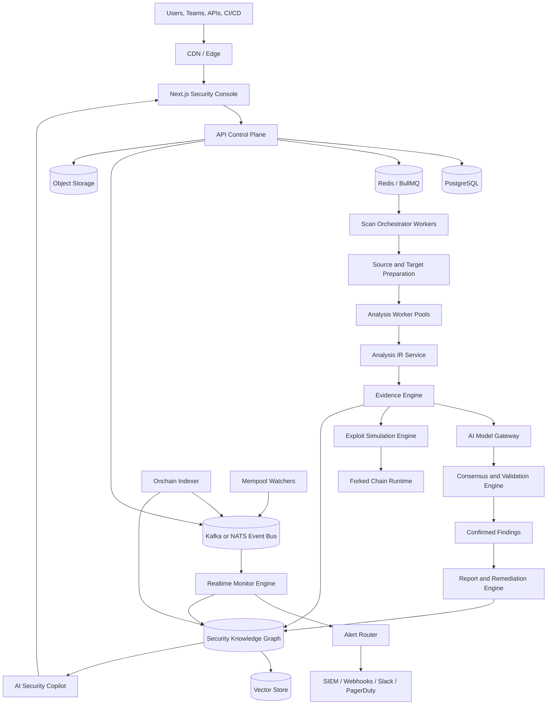
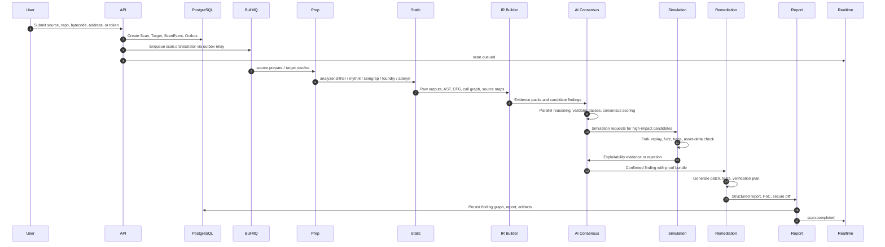
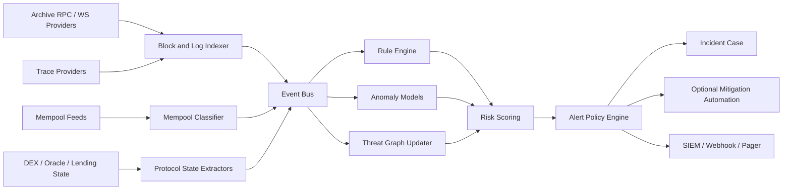
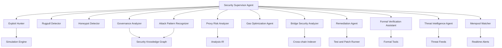

# Next-Generation Web3 Security OS Evolution Plan

This plan evolves the current audit scanner into an AI-native Web3 security operating system. It assumes the existing baseline documented in this repository: Next.js frontend, Express API, BullMQ workers, Redis realtime, Prisma/PostgreSQL, scanner adapters, hardened Docker scanner execution, RBAC, API keys, reports, WebSockets, Docker, CI/CD, and production deployment guidance.

The core strategic shift is from "scan and report" to "continuous evidence-backed security intelligence." LLMs become reasoning and remediation layers, not the source of truth. Static analysis, dynamic execution, exploit simulation, onchain telemetry, and a security knowledge graph provide the evidence that every AI claim must cite.

## 1. Platform Evolution Roadmap

### North Star

Build a multi-chain security command center that can:

- analyze contracts autonomously with low false positives
- prove exploitability through simulation where possible
- monitor deployed systems continuously
- generate secure patches and verification guidance
- learn from every scan, incident, exploit, audit report, and customer feedback loop
- expose the same intelligence through UI, API, CLI, GitHub, CI/CD, VSCode, and webhooks

### Product Maturity Phases

| Phase | Timeframe | Objective | Primary Deliverables |
| --- | ---: | --- | --- |
| Foundation hardening | 0 to 6 weeks | Make the existing scanner production-faithful | Durable object storage, persistent scan events, vulnerability persistence, analyzer failure semantics, transactional outbox, scanner image pinning |
| Evidence engine | 6 to 12 weeks | Convert scanner output into a first-class evidence model | Unified analysis IR, analyzer run table, evidence table, detector precision tracking, source maps, AST/CFG ingestion |
| AI consensus | 3 to 5 months | Add low-noise multi-model reasoning | Model gateway, prompt compiler, provider adapters, consensus scoring, validator agents, hallucination gates, eval harness |
| Simulation | 4 to 8 months | Move from suspected vulnerabilities to reproducible exploitability | Forked chain runner, Foundry/Anvil attack harness, transaction replay, exploit DSL, PoC artifact generation |
| Realtime monitoring | 6 to 10 months | Protect deployed contracts after launch | Chain indexer, mempool/block monitors, contract drift detection, alert policy engine, webhook/SIEM delivery |
| Threat graph | 8 to 12 months | Build proprietary intelligence moat | Knowledge graph, vector retrieval, exploit signature library, wallet risk graph, historical incident corpus |
| Enterprise OS | 9 to 15 months | Become institutional-grade | SAML/OIDC SSO, SCIM, tenant isolation hardening, SIEM, compliance reports, OpenTelemetry, customer-managed keys |
| Scale and ecosystem | 12 to 24 months | Become a platform, not a tool | Kubernetes, Kafka/NATS, GPU workers, SDKs, CLI, GitHub App, VSCode extension, plugin marketplace |

### Existing System To Keep

- Keep the monorepo and workspace boundaries.
- Keep BullMQ for near-term job execution.
- Keep Redis realtime for scan progress, but add a durable event store.
- Keep current scanner adapters and sandbox as the first analyzer tier.
- Keep Prisma/PostgreSQL as the control-plane system of record.
- Keep WebSockets, but extend them from scan progress to security operations streams.

### New Packages And Apps

```text
apps/
  api/                         existing control-plane API
  web/                         existing Next.js frontend
  worker/                      existing queue worker
  indexer/                     new block, log, trace, mempool ingestion
  model-gateway/               new LLM provider gateway and policy layer
  simulation-worker/           new fork and exploit simulation jobs
  monitor-worker/              new alert evaluation and notification jobs

packages/
  analysis-ir/                 AST, CFG, call graph, source map, bytecode IR
  agent-runtime/               typed agent tasks, budgets, memory, audit logs
  evidence-engine/             finding claims, evidence, confidence math
  model-gateway-client/        provider-neutral AI client
  simulation-engine/           fork orchestration, attack DSL, trace parser
  threat-graph/                graph schema, signatures, vector retrieval
  onchain-monitoring/          monitor rules, anomaly detectors, alert policy
  remediation-engine/          patch plans, diffs, verification gates
  plugin-sdk/                  safe plugin contracts for detectors/integrations
```

## 2. Architecture Diagrams

### Target Platform



### Scan Pipeline



### Continuous Monitoring Pipeline



## 3. Infrastructure Topology

### Near-Term Production

The current Render/Vercel/Supabase architecture can support early commercial use, but it needs these upgrades before enterprise claims:

- Replace local `.artifacts` with durable object storage.
- Persist every scan lifecycle transition in PostgreSQL.
- Add a transactional outbox so DB state and queue enqueue cannot diverge.
- Persist normalized vulnerabilities, analyzer metadata, and artifact checksums.
- Add strong image provenance: pinned digests, SBOMs, vulnerability scans, signature verification.
- Separate scanner, AI, PDF, and orchestration workers into distinct pools.
- Add OpenTelemetry traces across API, WebSockets, BullMQ, Prisma, Redis, Docker, and AI calls.

### Kubernetes Target

```text
global edge
  -> web ingress
  -> api-gateway namespace
      api pods
      websocket pods
      auth/rate-limit middleware
  -> control-plane namespace
      postgres writer/reader or managed HA postgres
      redis cluster
      event bus: Kafka or NATS JetStream
      object storage: S3/GCS/R2/MinIO
      graph db: Neo4j/Memgraph/Neptune
      vector db: pgvector/Qdrant/Weaviate/Pinecone
  -> workers namespace
      orchestration workers
      source prep workers
      static analysis workers
      symbolic execution workers
      simulation workers
      AI/report workers
      monitor workers
  -> secure-execution namespace
      Firecracker/Kata/gVisor sandbox nodes
      forked chain runners
      egress proxy
      artifact import service
  -> observability namespace
      OpenTelemetry collector
      Prometheus
      Grafana
      Loki or managed logs
      alertmanager
```

### Worker Pools

| Pool | Workload | Node type | Scale signal |
| --- | --- | --- | --- |
| Orchestration | scan DAG, lifecycle, outbox | small CPU | queue lag, oldest job age |
| Source prep | repo fetch, verifier fetch, compilation | network-restricted CPU | throughput, egress latency |
| Static analysis | Slither, Aderyn, Semgrep | CPU | queue depth, CPU |
| Symbolic execution | Mythril, Manticore, Halmos | high-memory CPU | active jobs, memory pressure |
| Fuzzing | Foundry, Echidna, Medusa | high-CPU | active campaigns, coverage rate |
| Simulation | Anvil/Hardhat/Tenderly-style forks | high-memory CPU, local SSD | fork startup time, trace volume |
| AI reasoning | prompt packs, consensus, remediation | CPU plus optional GPU | token queue latency, provider quota |
| GPU inference | self-hosted models, embeddings | GPU | model queue latency |
| Monitoring | block/mempool/event processing | CPU, network | block lag, topic lag |

### Event Backbone

Keep Redis/BullMQ for command execution during the transition. Introduce Kafka or NATS JetStream for durable event streams:

- `scan.events`
- `analysis.candidates`
- `analysis.evidence`
- `simulation.requests`
- `simulation.results`
- `findings.confirmed`
- `remediation.generated`
- `monitor.blocks`
- `monitor.mempool`
- `monitor.alerts`
- `threatintel.ingested`

Use topic schemas with versioned JSON Schema or Protobuf. Every event should carry `tenantId`, `scanId`, `contractId`, `traceId`, `causationId`, `correlationId`, and `schemaVersion`.

## 4. AI Multi-Engine Analysis System

### Design Principle

The AI system does not "find bugs" in isolation. It reasons over evidence produced by deterministic tools and simulations. A model can create hypotheses, but a finding only becomes high-confidence when the evidence engine validates it.

### Model Gateway

Create a provider-neutral gateway for GPT, Claude, Gemini, DeepSeek, Minimax, and local/self-hosted models.

Responsibilities:

- provider adapters
- model routing by task type, cost, latency, context length, and historical accuracy
- tenant-level provider policy
- prompt versioning and replay
- token accounting and cost attribution
- PII/source-code handling policy
- encrypted prompt and completion artifacts for enterprise auditability
- retry, timeout, rate-limit, circuit-breaker, and fallback logic

### Multi-Stage Reasoning Pipeline

```text
1. Evidence pack builder
   -> source snippets, AST nodes, CFG paths, call graph, analyzer output, tests, traces

2. Hypothesis generation
   -> multiple models independently propose candidate risks with required evidence references

3. Specialist critique
   -> exploitability, access control, oracle, governance, proxy, bridge, gas, remediation agents

4. Consensus engine
   -> agreement, disagreement, historical detector precision, severity calibration

5. Hard validator
   -> source-map check, line check, compiler check, trace check, schema check, contradiction check

6. Simulation or formal proof request
   -> fork PoC, fuzz counterexample, symbolic path, invariant violation, or formal condition

7. Finding decision
   -> rejected, informational, low-confidence candidate, confirmed finding, critical incident
```

### Hallucination Reduction

- Require every AI claim to cite a source range, AST node, trace step, transaction, detector result, or known exploit signature.
- Generate line numbers from parsers and source maps, never from free-form model output.
- Use structured outputs with Zod validation and strict schemas.
- Separate untrusted code/comments from system instructions in prompt envelopes.
- Run adversarial validator prompts that try to disprove each finding.
- Reject unsupported critical/high findings by default.
- Use "no proof, no critical" policy unless a human reviewer promotes the finding.
- Maintain per-model precision and recall metrics by vulnerability class.
- Add a regression corpus from known exploits, false positives, and fixed customer issues.

### Confidence And Exploitability Scoring

Separate severity, confidence, and exploitability.

```text
severity = asset impact + privilege impact + protocol invariant impact
confidence = evidence quality + detector agreement + model consensus + historical precision + validation result
exploitability = reachability + preconditions + capital required + attacker skill + onchain state viability + simulation result
priority = severity * confidence * exploitability * asset exposure
```

Finding confidence states:

- `CANDIDATE`: one detector or model hypothesis
- `SUPPORTED`: source/AST/CFG evidence exists
- `TRIAGED`: consensus and validator checks passed
- `SIMULATED`: exploit or invariant violation reproduced
- `CONFIRMED`: hard evidence sufficient for report
- `REJECTED`: contradicted by code, tests, state, or validator

## 5. Advanced Static And Dynamic Analysis

### Unified Analysis IR

Build `packages/analysis-ir` around a normalized representation:

- files, contracts, libraries, interfaces
- compiler metadata and source maps
- Solidity/Vyper/Yul AST
- bytecode, opcodes, selectors, storage layout
- CFG, call graph, inheritance graph
- dataflow and taint graph
- external call graph
- event/function ABI surface
- protocol dependency graph
- upgrade/proxy graph

### Analyzer Integration Tiers

| Tier | Tools | Purpose |
| --- | --- | --- |
| Existing | Slither, Mythril, Semgrep | preserve current baseline |
| Fast static | Aderyn, custom Semgrep, custom Slither detectors | sub-second to minute-level triage |
| Compiler-native | solc AST, SMTChecker, source maps | precise structure and proof hooks |
| Dynamic | Foundry, Hardhat, Echidna, Medusa | fuzz, invariant testing, stateful testing |
| Symbolic | Mythril, Manticore, Halmos, hevm-style engines | path discovery, counterexamples |
| Formal | Certora, Scribble, VerX/KEVM where useful | high-assurance properties |
| Bytecode | evm disassemblers, panopticon-style control flow, selectors | unverified contracts and deployed bytecode |

### Static Capabilities

- AST rule engine with type-aware matching.
- CFG generation for modifiers, fallback/receive, delegatecall paths, internal/external calls.
- Taint analysis from untrusted inputs to asset-moving sinks.
- Storage layout diffing for upgradeable contracts.
- Proxy pattern detection: EIP-1967, UUPS, transparent proxy, beacon proxy, diamond.
- Function selector collision detection.
- Privileged function reachability.
- Oracle dependency extraction.
- External integration inventory: DEX pools, lending markets, bridges, price feeds, keepers.
- Dependency graph analysis for imported packages, compiler versions, and vulnerable libraries.

### Dynamic Capabilities

- Compile and run project tests inside sandboxed workers.
- Generate Foundry invariants from discovered asset balances and protocol state.
- Generate fuzz harnesses from ABIs and critical functions.
- Use coverage feedback to prioritize AI review of untested paths.
- Run mutation testing to estimate whether project tests catch realistic security regressions.
- Replay historical transactions against forked state.
- Compare expected vs actual asset deltas after simulated attacks.

## 6. Exploit Simulation Engine

### Mission

Turn candidate risks into reproducible evidence. This is the strongest path to lower false positives and better enterprise trust.

### Core Components

```text
simulation-engine
  attack-plan compiler
  fork manager
  state loader
  transaction replay engine
  invariant checker
  fuzz campaign runner
  MEV bundle simulator
  trace parser
  asset-delta analyzer
  PoC generator
```

### Simulation Types

| Simulation | Implementation | Output |
| --- | --- | --- |
| Forked chain | Anvil/Hardhat fork with pinned block | deterministic reproduction environment |
| Transaction replay | replay known txs and altered calldata | behavior comparison |
| Flash loan | Aave/Balancer/Uniswap-style funding harness | capital feasibility |
| MEV attack | sandwich/backrun/bundle simulation | value extraction estimate |
| Liquidity drain | pool/oracle/liquidation route search | max loss bound |
| Governance takeover | voting power, quorum, timelock, proposal execution | takeover feasibility |
| Oracle manipulation | pool depth, TWAP windows, update cadence | required capital and profit |
| Bridge exploit | message verification, replay, finality assumptions | cross-chain impact |
| Upgrade exploit | proxy admin, storage collision, initializer path | control or corruption proof |

### Attack Plan DSL

Represent simulation requests as typed plans:

```json
{
  "kind": "oracle_manipulation",
  "chainId": 1,
  "forkBlock": 22400000,
  "targets": ["0x..."],
  "preconditions": ["attacker can trade pool", "pool has low liquidity"],
  "actions": [
    { "type": "flashloan", "asset": "WETH", "amount": "auto" },
    { "type": "swap", "pool": "auto", "direction": "WETH_TO_TOKEN" },
    { "type": "call", "contract": "target", "function": "liquidate" },
    { "type": "repay_flashloan" }
  ],
  "successCriteria": {
    "attackerProfitUsd": { "gt": 0 },
    "victimLossUsd": { "gt": 10000 }
  }
}
```

### PoC Generation

Generate:

- Foundry test file
- attack contract
- fork configuration
- calldata sequence
- trace summary
- asset delta table
- reproducibility hash

High-risk guardrail: never broadcast transactions. The execution engine only signs against local forks unless an enterprise customer explicitly enables controlled testnet automation.

## 7. Autonomous AI Security Agents

### Agent Runtime

Create `packages/agent-runtime` with:

- typed input/output schemas
- task budgets
- model policy
- memory retrieval rules
- tool permission scopes
- evidence requirements
- human approval gates
- immutable agent audit logs

### Agent Topology



### Agent Responsibilities

| Agent | Inputs | Outputs | Hard Gates |
| --- | --- | --- | --- |
| Exploit hunter | findings, IR, onchain state | attack plans, PoCs, exploitability score | simulation or symbolic evidence for high severity |
| Rugpull detector | token code, ownership, liquidity, holders | rugpull indicators, centralization risks | distinguish admin risk from malicious intent |
| Honeypot detector | token transfer paths, DEX simulation | buy/sell feasibility, trap conditions | forked buy/sell simulation |
| Governance analyzer | voting contracts, token distribution, timelocks | takeover scenarios, quorum risk | current voting power and timelock math |
| Proxy risk analyzer | bytecode, storage layout, admin roles | upgrade risks, storage collision findings | source map or bytecode proof |
| Bridge analyzer | message validation, light client, relayers | replay/finality/validator risks | cross-chain state assumptions documented |
| Gas optimization agent | AST, traces, benchmarks | gas findings, optimized diff | no security regression, tests pass |
| Remediation agent | confirmed finding, codebase | patch diff, tests, migration notes | compile, test, static re-scan |
| Formal verification assistant | invariants, specs, contracts | Scribble/Certora/SMT specs | human approval before authoritative proof claims |
| Threat intelligence agent | feeds, incidents, chain data | signatures, actor clusters, risk bulletins | source provenance and confidence labels |
| Mempool watcher | pending txs, watched contracts | early-warning alerts | low-latency path, degraded coverage flag |
| Attack pattern recognizer | graph, historical exploits, new findings | reusable signatures and detector ideas | validation on benchmark corpus |

## 8. Realtime Onchain Monitoring

### Monitoring Scope

- mempool monitoring
- whale monitoring
- suspicious transaction detection
- liquidity anomaly detection
- governance proposal and vote attack alerts
- proxy upgrade alerts
- privileged role changes
- oracle deviation alerts
- contract behavior drift detection
- wallet risk scoring
- exploit early-warning system

### Detection Model

Combine deterministic rules and anomaly scoring:

- known malicious address interaction
- abnormal approval/transfer volume
- liquidity removal outside baseline
- sudden slippage and pool imbalance
- admin function calls on sensitive contracts
- proxy implementation changes
- role grants/revokes
- governance quorum concentration
- oracle price divergence vs external reference
- contract event distribution drift
- mempool transaction simulates to large user/protocol loss

### Alert Lifecycle

```text
raw event
  -> enrichment: contract metadata, labels, risk graph, price, liquidity
  -> rule/anomaly evaluation
  -> dedupe and correlation
  -> severity and confidence
  -> incident case
  -> notification
  -> optional response playbook
  -> post-incident learning
```

### Response Automation

Enterprise customers can define guarded playbooks:

- page security team
- open incident case
- notify Safe signers
- prepare pause transaction
- prepare parameter update
- call customer webhook
- generate human-readable calldata summary

Default posture: prepare mitigations, do not execute production transactions without explicit customer policy and approval workflow.

## 9. AI Remediation Engine

### Patch Pipeline

```text
confirmed finding
  -> root cause extraction
  -> vulnerable range selection
  -> patch strategy generation
  -> secure diff generation
  -> compile/test/static re-scan
  -> simulation regression
  -> gas benchmark
  -> migration/deployment guidance
```

### Remediation Outputs

- vulnerable line and dataflow explanation
- secure patch diff
- test case that fails before and passes after
- Foundry/Hardhat invariant or regression test
- gas benchmark delta
- migration notes for deployed contracts
- secure coding recommendation
- exploit prevention guidance
- rollback risks

### Patch Safety Gates

- never patch without preserving compiler version and project style
- run formatting and tests in sandbox
- forbid broad rewrites unless requested
- flag behavior-changing fixes
- require human review before merge or PR creation
- re-run the scanner pipeline against the patched code

## 10. Security Knowledge Graph

### Purpose

The knowledge graph is the platform moat. It links code structures, vulnerabilities, exploits, wallets, incidents, protocols, dependencies, mitigations, and historical outcomes.

### Storage Strategy

- PostgreSQL for source-of-truth relational records.
- Graph database for relationships and traversal.
- Vector store for semantic retrieval over reports, code snippets, exploit writeups, and remediation guidance.
- Object storage for raw artifacts and reproducibility bundles.

### Core Entities

```text
Tenant
Project
Repository
Chain
Contract
Function
StorageSlot
Selector
Dependency
AnalyzerRun
Finding
Evidence
SimulationRun
ExploitPoC
Incident
Transaction
Wallet
Token
Protocol
ThreatActorCluster
ExploitSignature
RemediationPatch
MonitorRule
Alert
```

### Edge Examples

```text
Contract IMPLEMENTS Function
Function CALLS Function
Function WRITES StorageSlot
Finding AFFECTS Function
Finding SUPPORTED_BY Evidence
SimulationRun CONFIRMS Finding
Wallet FUNDED Wallet
Wallet CALLED Contract
Transaction TRIGGERED Alert
ExploitSignature MATCHES Finding
RemediationPatch FIXES Finding
Contract DEPENDS_ON Protocol
Contract PROXIED_BY Contract
```

### Intelligence Products

- exploit database
- historical hack pattern library
- vulnerability relationship map
- attacker behavior graph
- chain-wide threat graph
- reusable exploit signatures
- vector search over audit reports and incidents
- detector recommendation engine
- customer-specific risk baselines

## 11. Advanced Frontend Experience

### Product Surface

Keep the interface operational, not decorative. The user should land directly in the security command center.

Primary views:

- Security Command Center: portfolio risk, live alerts, scans, monitored contracts.
- Scan Workbench: progress, analyzer output, evidence timeline, file explorer.
- Vulnerability Explorer: grouped findings, dataflow, source ranges, evidence, confidence, exploitability.
- Exploit Simulation UI: fork block, attack plan, trace, balances, calldata, PoC.
- Attack Graph: contract/function/wallet/transaction relationships.
- Security Radar: realtime threats by chain, protocol, severity, confidence.
- Threat Heatmaps: wallet clusters, liquidity anomalies, governance risks.
- AI Chat Audit Assistant: source-aware and evidence-bound copilot.
- Live Terminal Stream: scanner logs, sandbox events, simulations.
- Remediation Studio: secure diff, tests, verification status.
- Monitoring Ops: alert policies, playbooks, incidents, integrations.

### Visualization Stack

- Next.js and React remain the shell.
- Add Three.js/WebGL for dense attack graphs and animated simulation timelines.
- Use Cytoscape.js, Sigma.js, or React Flow for graph interactions where appropriate.
- Use Recharts only for conventional charts.
- Use Web Workers for large graph layout.
- Use server-sent snapshots plus WebSocket deltas for live views.

### UX Differentiators

- Every finding has an evidence drawer.
- Every critical finding has an exploitability explanation.
- Every AI statement links to code, trace, or graph evidence.
- Simulation traces show asset deltas and attacker profit/loss.
- Alerts open directly into incident timelines and recommended actions.
- Reports are exportable, but the primary artifact is interactive.

## 12. Enterprise Security And Compliance

### Enterprise Capabilities

- SAML/OIDC SSO
- SCIM provisioning
- hierarchical RBAC
- project-level and environment-level permissions
- API key governance with scopes, expiration, owners, and rotation
- tenant isolation controls
- immutable audit trails
- compliance reporting
- SIEM integration
- OpenTelemetry traces and audit exports
- customer-managed keys for enterprise object storage
- secrets management through Vault/KMS
- private deployment option

### Tenant Isolation

- enforce `organizationId` on every business table
- add Postgres RLS for enterprise deployments where feasible
- per-tenant object storage prefixes and encryption keys
- per-tenant rate limits and queue quotas
- per-tenant model provider policy
- separate enterprise worker pools for sensitive customers
- optional single-tenant deployment

### SOC2 Readiness

Map implementation to controls:

- access control: SSO, MFA, RBAC, least privilege
- change management: CI/CD approvals, migration review, deployment audit logs
- logging and monitoring: immutable audit log, SIEM, alerts
- incident response: runbooks, severity process, postmortems
- vendor management: AI providers, RPC providers, cloud providers
- data protection: encryption in transit/at rest, retention, deletion
- availability: HA architecture, backups, restore drills, SLOs

## 13. Massive Scale Infrastructure

### Scaling Strategy

- Use KEDA to scale worker deployments from BullMQ and Kafka/NATS lag.
- Use HPA for API and WebSocket pods.
- Use cluster autoscaler across specialized node pools.
- Use Redis Cluster or managed Redis for queue scale.
- Use Kafka/NATS for durable high-throughput telemetry and monitoring streams.
- Use object storage for all raw artifacts.
- Cache compiler downloads and scanner images in an internal registry.
- Cache verified source and bytecode metadata by chain/address/source hash.
- Cache fork snapshots where legally and technically safe.
- Use GPU workers for self-hosted models, embeddings, and high-volume triage.

### Multi-Region

Control plane can start single-region HA. Monitoring and simulation should become regional:

- regional chain ingestion close to RPC providers
- regional worker clusters for latency-sensitive monitoring
- central global threat graph with regional replicas
- data residency controls for enterprise tenants
- failover runbooks for API, worker, Redis, and database layers

### Queue Evolution

Short term:

- BullMQ for existing jobs
- Redis Pub/Sub/List for realtime
- PostgreSQL outbox for reliability

Medium term:

- Kafka/NATS for events
- BullMQ still performs command jobs
- durable scan event store powers replay

Long term:

- Temporal or a custom DAG orchestrator for long-running, resumable workflows
- event bus for all telemetry
- dedicated scheduler for recurring monitors and scans

## 14. Threat Intelligence Platform

### Feed Sources

- public exploit databases and incident writeups
- audit report corpora
- chain analytics labels
- scam token lists
- phishing domains and wallet drainer indicators
- verified malicious contracts
- bug bounty findings
- customer-confirmed false positives and true positives
- platform-generated simulation signatures

### Intelligence Capabilities

- public exploit feed
- hacker wallet tracking with confidence labels
- scam token intelligence
- phishing and drainer detection
- malware contract detection
- cross-chain risk correlation
- attacker clustering
- AI threat prediction
- detector generation from new exploit patterns
- customer exposure mapping

### Governance

- all labels require provenance
- distinguish confirmed identity from behavioral cluster
- show confidence and last-seen time
- support correction workflows
- avoid defamatory identity claims without authoritative evidence

## 15. Developer Ecosystem

### Developer Products

- TypeScript SDK
- Python SDK
- CLI
- GitHub App
- GitHub Action
- GitLab and Bitbucket integrations
- VSCode extension
- webhook ecosystem
- API marketplace
- detector/plugin marketplace
- local scanner mode for private repos

### CLI Commands

```text
audit scan .
audit scan --repo <url>
audit monitor add --chain ethereum --address 0x...
audit report open <scanId>
audit fix <findingId>
audit simulate <findingId>
audit ci --fail-on high --min-confidence supported
audit plugin init
```

### Plugin Architecture

Plugins can provide:

- static detectors
- remediation recipes
- monitor rules
- report sections
- threat intel feeds
- simulation templates
- custom enterprise integrations

Plugin safety:

- signed plugins
- manifest-declared permissions
- sandboxed execution
- no ambient network or filesystem access
- versioned APIs
- review process for marketplace publication

## 16. Advanced Module Breakdown

| Module | Owns | Key APIs |
| --- | --- | --- |
| Target Resolver | address/source/repo/bytecode normalization | `resolveTarget`, `fetchVerifiedSource`, `compileTarget` |
| Analysis IR | AST/CFG/bytecode/dataflow | `buildIr`, `queryIr`, `exportEvidencePack` |
| Evidence Engine | finding claims and proof bundles | `createCandidate`, `attachEvidence`, `scoreFinding` |
| Model Gateway | LLM provider orchestration | `reason`, `critique`, `consensus`, `embed` |
| Agent Runtime | agent DAGs and audit logs | `runAgent`, `scheduleAgent`, `getAgentTrace` |
| Simulation Engine | fork, replay, attack plans | `simulate`, `generatePoc`, `parseTrace` |
| Remediation Engine | patches and tests | `generatePatch`, `verifyPatch`, `benchmarkGas` |
| Monitor Engine | realtime rules and alerts | `createMonitor`, `evaluateEvent`, `openIncident` |
| Threat Graph | graph and vector intelligence | `upsertEntity`, `link`, `search`, `matchSignature` |
| Reporting | PDF/HTML/interactive reports | `generateReport`, `publishReport`, `exportEvidence` |
| Enterprise Admin | SSO, SCIM, RBAC, audit | `provisionUser`, `assignRole`, `exportAuditLog` |

## 17. Enterprise Deployment Strategy

### SaaS

- multi-tenant shared control plane
- isolated worker quotas by tier
- encrypted object storage
- tenant-level retention policies
- optional private model routing
- SOC2 controls and audit exports

### Dedicated Enterprise

- isolated namespace or cluster
- dedicated database schema or instance
- dedicated object bucket and KMS key
- private networking to customer RPCs and repositories
- customer-managed model provider keys
- SIEM and SSO integrations

### Air-Gapped Or Regulated

- self-hosted scanner images
- offline model option
- local vector store and graph DB
- signed update bundles
- no external telemetry by default
- manual threat-intel import pipeline

## 18. Security Hardening Strategy

### Secure Execution Engine

Move from hardened Docker to defense-in-depth:

- rootless Docker for current baseline
- gVisor or Kata for stronger container isolation
- Firecracker microVMs for untrusted code and fork simulation
- no default network for scanner jobs
- explicit egress proxy for source fetch jobs
- read-only source mounts
- separate writable output mounts
- artifact import through a sanitizing sidecar
- CPU, memory, pid, file, stdout, stderr, wall-clock, and artifact limits
- signed scanner images and pinned digests
- SBOM and vulnerability scanning in CI

### Sandbox Escape Prevention

- no privileged containers
- drop all capabilities
- seccomp default deny where feasible
- AppArmor/SELinux profiles
- no Docker socket inside workers
- dedicated scanner nodes
- short-lived per-job workspaces
- no host path mounts except controlled read-only source and output directories
- kernel patch cadence and node rotation

### eBPF Monitoring

Use eBPF on scanner nodes to watch:

- unexpected network calls
- suspicious syscalls
- process trees
- file writes outside allowed paths
- attempts to access metadata services
- abnormal CPU or memory behavior

Emit runtime security events into the same event bus and SIEM.

### SSRF And Egress Defense

- URL allowlists for repository and verifier fetches
- block link-local, RFC1918, metadata, and internal ranges
- DNS pinning and redirect validation
- separate fetch service from scanner service
- no arbitrary web fetch from model-generated instructions
- content-type and archive validation

### Prompt Injection Defense

- treat contract comments, README files, audit docs, and repository text as untrusted data
- isolate untrusted text in prompt sections with explicit labels
- never let model output call privileged tools directly
- require structured tool calls with policy checks
- strip secrets from prompts
- redact proprietary code according to tenant policy
- run validators that detect instruction-following from untrusted code comments

### AI Abuse Prevention

- rate limits by org, user, API key, and model task
- abuse classifier for exploit-generation requests outside owned/authorized targets
- require target ownership or explicit scope for simulations
- watermark and audit AI-generated PoCs
- prevent public sharing of sensitive exploit details by default
- human approval for high-impact automated remediation or mitigation workflows

## 19. Competitive Differentiation Analysis

### Current Market Signals

- CertiK Skynet emphasizes a real-time project security score across code security, fundamentals, operational resilience, governance, market dynamics, and community trust, and CertiK is also positioning AI Auditor and autonomous AI agents.
- Hacken positions around blockchain-native security, compliance, AI-powered offensive security, audits, bug bounties, and 24/7 onchain monitoring with auto-pause style responses.
- Cyfrin combines professional/competitive audits, Aderyn as a fast Rust static analyzer, CodeHawks as a competitive audit platform, and Solodit as a vulnerability research corpus.
- OpenZeppelin is sunsetting Defender on July 1, 2026 and shifting toward open-source Relayer and Monitor tools with multi-chain monitoring and transaction infrastructure.
- Trail of Bits remains a benchmark for deep manual review and open-source tooling such as Slither, Echidna, and Medusa.

### How To Surpass

| Competitor | Their strength | Differentiation strategy |
| --- | --- | --- |
| CertiK AI Auditor / Skynet | public ratings, broad data, brand trust, AI positioning | provide evidence-backed findings, simulation-confirmed exploitability, customer-owned private intelligence, richer interactive remediation |
| Hacken | audits, compliance, offensive security, monitoring | combine continuous monitoring with autonomous simulation and patch verification, then package compliance evidence automatically |
| Cyfrin | developer education, competitive audits, Aderyn, Solodit | integrate fast static analysis plus dynamic proof, offer local-first developer workflows, create feedback loops from public and private findings |
| OpenZeppelin Defender/Open Source Stack | trusted libraries, relayer/monitor primitives | become the security intelligence layer on top of relayers/monitors, not only an operations tool |
| Trail of Bits | research depth, tooling, root-cause review | use their-style tools as evidence inputs, then add autonomous triage, protocol simulation, continuous monitoring, and enterprise workflow automation |

### Differentiation Pillars

- Lower false positives: evidence gating, consensus, simulation, precision telemetry.
- Faster scans: tiered analysis, cache reuse, fast static first, deep analysis only where risk warrants.
- Better AI reasoning: multiple models, adversarial validation, source-bound claims, eval corpus.
- UX superiority: interactive evidence, live simulations, attack graphs, remediation studio.
- Autonomous analysis: specialized agents with hard gates and audit trails.
- Realtime intelligence: mempool/block monitoring, threat graph, early-warning alerts.
- Exploit simulation: forked PoCs and asset delta proof.
- Continuous monitoring: risk posture changes after deploy, not one-time PDFs.

## 20. Implementation Priorities

### P0: Production Correctness

- durable artifact storage
- vulnerability persistence
- analyzer run persistence
- scan event table
- transactional outbox
- partial completion semantics
- dead-letter replay tooling
- scanner image digest pinning
- OpenTelemetry end-to-end traces

### P1: Evidence Model

- `FindingCandidate`
- `FindingEvidence`
- `AnalyzerRun`
- `SourceRange`
- `TraceEvidence`
- `DetectorPrecisionMetric`
- normalized confidence and exploitability scoring

### P2: IR And Static Expansion

- solc AST ingestion
- source maps
- CFG/call graph
- storage layout
- bytecode disassembly
- Aderyn adapter
- custom detector SDK

### P3: AI Consensus

- model gateway
- provider adapters
- prompt compiler
- validator layer
- consensus engine
- model eval harness
- cost/latency dashboards

### P4: Simulation

- fork runner
- attack plan DSL
- transaction replay
- Foundry PoC generator
- asset-delta analyzer
- simulation artifacts in reports

### P5: Monitoring And Threat Graph

- block/log indexer
- monitor rules
- mempool provider abstraction
- alert router
- knowledge graph
- vector retrieval
- wallet and contract risk scoring

### P6: Enterprise And Ecosystem

- SSO/SCIM
- SIEM
- advanced audit trails
- SDKs
- CLI
- GitHub App
- VSCode extension
- plugin marketplace

## 21. Product Strategy

### MVP Roadmap

MVP should not try to ship all agents. Ship the smallest credible high-signal loop:

- existing scanner plus durable evidence model
- fast static scan and AI triage
- confidence/exploitability scoring
- interactive vulnerability explorer
- remediation suggestions
- GitHub Action and CLI
- basic onchain monitor for proxy upgrades, admin calls, and liquidity removal

### Enterprise Roadmap

- private scans
- dedicated worker pools
- SAML/OIDC SSO
- SCIM
- audit log export
- SIEM integration
- compliance evidence exports
- customer-managed keys
- private model routing
- custom monitor rules and playbooks

### Monetization

| Tier | Buyer | Pricing basis |
| --- | --- | --- |
| Developer | indie teams | monthly scans, CI minutes, limited AI |
| Team | protocol teams | projects, monitored contracts, scan depth |
| Enterprise | institutions | seats, private workers, SSO, retention, support |
| Monitoring | live protocols | watched contracts, chains, alert volume |
| API | security platforms/wallets/exchanges | request volume, risk lookups, webhook volume |
| Incident response | high-risk protocols | retainer plus emergency usage |

### Network Effects

- public vulnerability knowledge base with safe summaries
- plugin marketplace
- detector marketplace
- community false-positive feedback
- benchmark corpus
- anonymized attack-pattern telemetry
- integration partner ecosystem

## 22. Future Research Roadmap

- AI-assisted invariant mining from code and production traces.
- Neuro-symbolic vulnerability detection combining CFG/dataflow with LLM reasoning.
- Automated exploit search using reinforcement learning over forked chain state.
- Cross-chain exploit simulation with finality and bridge assumptions.
- MEV-aware vulnerability scoring.
- Wallet cluster risk prediction with explainability.
- Formal spec generation with human-in-the-loop approval.
- Zero-knowledge attestations for private audit results.
- Secure multi-party sharing of threat intel across protocols.
- AI red-teaming for agentic smart contracts and autonomous wallets.
- Post-quantum readiness analysis for chain protocols and signing infrastructure.

## 23. External References Used For Competitive Context

- CertiK AI Auditor and Agent Security: https://skynet.certik.com/quest/certiks-ai-auditor-and-agent-security
- CertiK Skynet Score methodology: https://skynet.certik.com/skynet-score-methodology
- Hacken public platform positioning: https://hacken.io/
- Cyfrin Aderyn overview: https://aderyn.cyfrin.io/overview
- Cyfrin platform docs: https://docs.cyfrin.io/en/
- Cyfrin Solodit overview: https://docs.cyfrin.io/solodit/overview
- OpenZeppelin Defender sunset announcement: https://www.openzeppelin.com/news/doubling-down-on-open-source-and-phasing-out-defender
- OpenZeppelin Monitor docs: https://docs.openzeppelin.com/monitor
- OpenZeppelin Relayer docs: https://docs.openzeppelin.com/relayer/1.4.x
- Trail of Bits blockchain security page: https://www.trailofbits.com/services/software-assurance/blockchain/
- Trail of Bits open-source tooling page: https://www.trailofbits.com/opensource/
