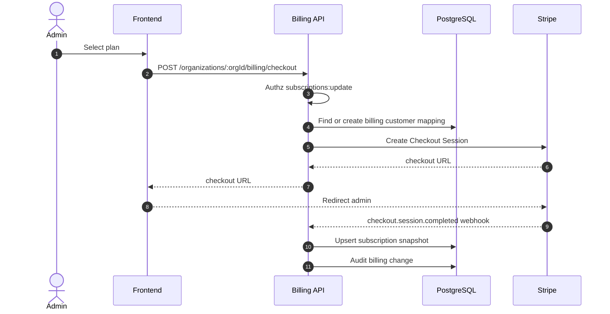
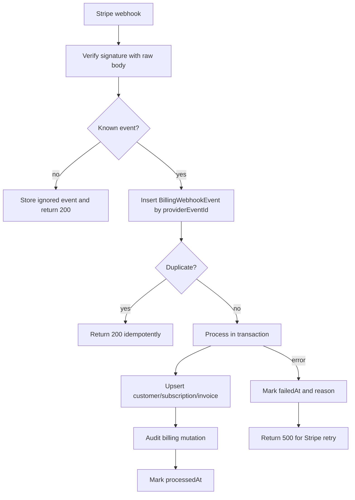
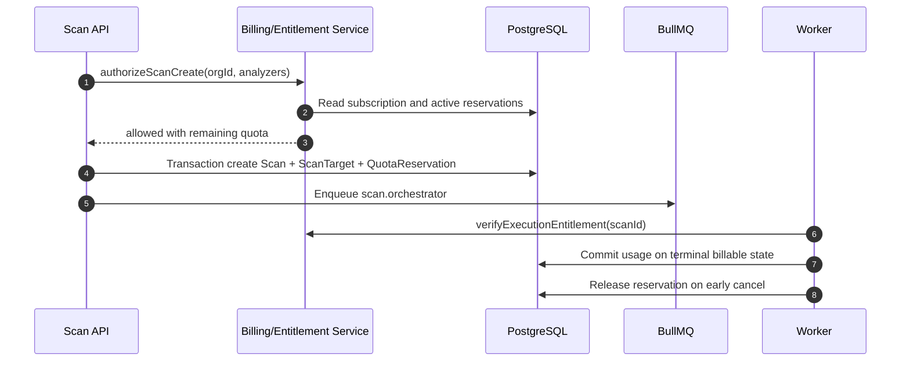

# SaaS Billing Architecture

This architecture extends the current organization-scoped subscription model into an enterprise-grade SaaS billing system for the AI smart contract audit scanner.

Current foundation:

- `Organization` owns scans, API keys, members, subscriptions, reports, and audit logs.
- `Subscription` already stores `tier`, `status`, `provider`, Stripe-like customer/subscription IDs, billing period, monthly scan quota, and scans used in the current period.
- API routes already expose organization subscription read/update endpoints protected by RBAC.

## Billing Goals

- Support free tier, premium plans, enterprise/custom contracts, and trialing accounts.
- Enforce scan quotas before queueing expensive scan work.
- Meter API and scanner usage by organization and API key.
- Use Stripe as the source of truth for paid subscription state, invoices, and payment lifecycle.
- Keep internal usage ledger as the source of truth for entitlement enforcement and auditability.
- Make webhook processing idempotent, replayable, and safe against spoofing.
- Keep billing organization-scoped, not user-scoped.

## Plan Catalog

Plan definitions should live in versioned application config, with Stripe price IDs mapped by environment.

| Plan | Target | Monthly scans | API requests | Analyzer concurrency | AI reports | Retention |
| --- | --- | ---: | ---: | ---: | --- | --- |
| Free | evaluation | 3 | 1,000 | 1 | limited/basic | 7 days |
| Pro | solo/pro users | 50 | 25,000 | 2 | included | 90 days |
| Team | small teams | 250 | 250,000 | 6 | included | 1 year |
| Enterprise | security orgs | custom | custom | custom | included/custom model | custom |
| Custom | contracts | custom | custom | custom | custom | custom |

Recommended entitlement dimensions:

```text
scan.quota.monthly
scan.concurrent.limit
scan.analyzers.allowed
scan.max.contracts.per.scan
api.requests.monthly
api.rate_limit.per_minute
ai.report.monthly
artifact.retention.days
report.exports.monthly
members.limit
support.level
```

Free tier rules:

- A free organization has a valid active `FREE` subscription row.
- Free quota resets monthly.
- Free tier can create API keys, but API requests are metered and rate limited.
- Premium-only analyzers or AI report features should fail fast before queueing.

Premium rules:

- `PRO`, `TEAM`, `ENTERPRISE`, and `CUSTOM` are active only when Stripe subscription state maps to `TRIALING`, `ACTIVE`, or temporarily `PAST_DUE`.
- `PAST_DUE` should enter a grace period. After grace expires, downgrade enforcement to read-only plus billing portal access.
- Enterprise/custom contracts may override Stripe-derived quotas with internal contract metadata.

## Service Boundaries

```text
Frontend
  -> Billing API
    -> BillingService
      -> PlanCatalog
      -> EntitlementService
      -> UsageMeteringService
      -> StripeBillingProvider
      -> BillingRepository/Prisma
      -> AuditLog

Stripe
  -> Webhook endpoint
    -> Raw body signature verification
    -> WebhookEvent idempotency store
    -> BillingWebhookProcessor
    -> Subscription/Invoice/Usage synchronization
```

Core services:

- `BillingService`: checkout, billing portal, subscription status, invoice views.
- `PlanCatalog`: immutable app-side plan and entitlement map.
- `EntitlementService`: computes effective entitlements for an organization.
- `UsageMeteringService`: records and aggregates usage events.
- `SubscriptionEnforcementService`: reserves quota before scan enqueue and finalizes/release reservations.
- `StripeBillingProvider`: isolated Stripe SDK wrapper.
- `BillingWebhookProcessor`: maps Stripe events to internal state.

## Data Model

Keep the existing `Subscription` model as the current subscription snapshot. Add append-only usage and webhook tables for auditability.

Recommended Prisma additions:

```prisma
enum BillingUsageMetric {
  SCAN_CREATED
  SCAN_COMPLETED
  SCAN_FAILED
  API_REQUEST
  ANALYZER_SECONDS
  AI_REPORT
  AI_TOKENS_INPUT
  AI_TOKENS_OUTPUT
  REPORT_EXPORT
  ARTIFACT_STORAGE_GB_DAY
}

enum BillingUsageSource {
  API
  WORKER
  STRIPE
  SYSTEM
}

enum BillingReservationStatus {
  ACTIVE
  COMMITTED
  RELEASED
  EXPIRED
}

model BillingUsageEvent {
  id             String             @id @default(uuid()) @db.Uuid
  organizationId String             @map("organization_id") @db.Uuid
  apiKeyId       String?            @map("api_key_id") @db.Uuid
  scanId         String?            @map("scan_id") @db.Uuid
  subscriptionId String?            @map("subscription_id") @db.Uuid
  idempotencyKey String             @unique @map("idempotency_key") @db.VarChar(220)
  metric         BillingUsageMetric
  source         BillingUsageSource
  quantity       Decimal            @db.Decimal(20, 6)
  unit           String             @db.VarChar(40)
  metadata       Json?
  occurredAt     DateTime           @map("occurred_at")
  createdAt      DateTime           @default(now()) @map("created_at")

  organization   Organization       @relation(fields: [organizationId], references: [id], onDelete: Cascade)
  apiKey         ApiKey?            @relation(fields: [apiKeyId], references: [id], onDelete: SetNull)
  scan           Scan?              @relation(fields: [scanId], references: [id], onDelete: SetNull)
  subscription   Subscription?      @relation(fields: [subscriptionId], references: [id], onDelete: SetNull)

  @@index([organizationId, metric, occurredAt])
  @@index([scanId])
  @@map("billing_usage_events")
}

model BillingQuotaReservation {
  id             String                   @id @default(uuid()) @db.Uuid
  organizationId String                   @map("organization_id") @db.Uuid
  scanId         String                   @unique @map("scan_id") @db.Uuid
  subscriptionId String?                  @map("subscription_id") @db.Uuid
  metric         BillingUsageMetric
  quantity       Int
  status         BillingReservationStatus @default(ACTIVE)
  expiresAt      DateTime                 @map("expires_at")
  committedAt    DateTime?                @map("committed_at")
  releasedAt     DateTime?                @map("released_at")
  createdAt      DateTime                 @default(now()) @map("created_at")
  updatedAt      DateTime                 @updatedAt @map("updated_at")

  organization   Organization             @relation(fields: [organizationId], references: [id], onDelete: Cascade)
  scan           Scan                     @relation(fields: [scanId], references: [id], onDelete: Cascade)
  subscription   Subscription?            @relation(fields: [subscriptionId], references: [id], onDelete: SetNull)

  @@index([organizationId, status, expiresAt])
  @@map("billing_quota_reservations")
}

model BillingInvoice {
  id               String    @id @default(uuid()) @db.Uuid
  organizationId   String    @map("organization_id") @db.Uuid
  subscriptionId   String?   @map("subscription_id") @db.Uuid
  provider         String    @db.VarChar(80)
  providerInvoiceId String   @unique @map("provider_invoice_id") @db.VarChar(160)
  status           String    @db.VarChar(80)
  currency         String    @db.VarChar(12)
  amountDueCents   Int       @map("amount_due_cents")
  amountPaidCents  Int       @map("amount_paid_cents")
  hostedInvoiceUrl String?   @map("hosted_invoice_url") @db.Text
  invoicePdfUrl    String?   @map("invoice_pdf_url") @db.Text
  periodStart      DateTime? @map("period_start")
  periodEnd        DateTime? @map("period_end")
  dueDate          DateTime? @map("due_date")
  paidAt           DateTime? @map("paid_at")
  metadata         Json?
  createdAt        DateTime  @default(now()) @map("created_at")
  updatedAt        DateTime  @updatedAt @map("updated_at")

  organization     Organization @relation(fields: [organizationId], references: [id], onDelete: Cascade)
  subscription     Subscription? @relation(fields: [subscriptionId], references: [id], onDelete: SetNull)

  @@index([organizationId, createdAt])
  @@map("billing_invoices")
}

model BillingWebhookEvent {
  id              String    @id @default(uuid()) @db.Uuid
  provider        String    @db.VarChar(80)
  providerEventId String    @unique @map("provider_event_id") @db.VarChar(180)
  eventType       String    @map("event_type") @db.VarChar(180)
  payload         Json
  processedAt     DateTime? @map("processed_at")
  failedAt        DateTime? @map("failed_at")
  failureReason   String?   @map("failure_reason") @db.Text
  createdAt       DateTime  @default(now()) @map("created_at")

  @@index([provider, eventType, createdAt])
  @@map("billing_webhook_events")
}
```

Recommended additions to existing models:

- `Subscription.providerPriceId`
- `Subscription.cancelAtPeriodEnd`
- `Subscription.trialEndsAt`
- `Subscription.gracePeriodEndsAt`
- `Subscription.metadata.entitlements`
- `ApiKey.billingLabel` or metadata field for usage attribution

## Stripe Architecture

Stripe objects:

- Customer: one per organization.
- Subscription: one active subscription snapshot per organization.
- Price/Product: maps to internal plan and billing interval.
- Checkout Session: plan upgrade and initial subscription creation.
- Billing Portal Session: self-service payment method, invoices, cancellation.
- Invoice: copied into internal `BillingInvoice`.
- Optional usage records: only needed if using Stripe metered billing for API/compute overages.

Environment variables:

```text
STRIPE_SECRET_KEY=
STRIPE_WEBHOOK_SECRET=
STRIPE_PRICE_FREE=
STRIPE_PRICE_PRO_MONTHLY=
STRIPE_PRICE_PRO_YEARLY=
STRIPE_PRICE_TEAM_MONTHLY=
STRIPE_PRICE_TEAM_YEARLY=
STRIPE_BILLING_PORTAL_RETURN_URL=
STRIPE_CHECKOUT_SUCCESS_URL=
STRIPE_CHECKOUT_CANCEL_URL=
BILLING_PAST_DUE_GRACE_DAYS=7
```

Stripe is the payment source of truth. Internal subscriptions are enforcement snapshots derived from Stripe plus enterprise overrides.

## Checkout Flow



API endpoints:

```text
GET  /api/v1/billing/plans
GET  /api/v1/organizations/:organizationId/billing/current
GET  /api/v1/organizations/:organizationId/billing/usage
GET  /api/v1/organizations/:organizationId/billing/invoices
POST /api/v1/organizations/:organizationId/billing/checkout
POST /api/v1/organizations/:organizationId/billing/portal
POST /api/v1/billing/webhooks/stripe
```

RBAC:

- `subscriptions:read`: read current plan, invoices, and usage summaries.
- `subscriptions:update`: create checkout sessions, open billing portal, cancel/change plans.
- `organizations:update`: update billing email and tax metadata.

## Usage Metering

Usage must be append-only and idempotent. Counters can be cached, but the ledger is authoritative.

Usage events:

| Metric | Source | Idempotency key |
| --- | --- | --- |
| `SCAN_CREATED` | API before enqueue | `scan:<scanId>:created` |
| `SCAN_COMPLETED` | worker terminal event | `scan:<scanId>:completed` |
| `SCAN_FAILED` | worker terminal event | `scan:<scanId>:failed` |
| `API_REQUEST` | API middleware | `request:<requestId>` |
| `ANALYZER_SECONDS` | analyzer worker | `scan:<scanId>:<analyzer>:seconds` |
| `AI_REPORT` | report worker | `scan:<scanId>:ai-report` |
| `AI_TOKENS_INPUT` | AI provider wrapper | `scan:<scanId>:ai-input-tokens` |
| `AI_TOKENS_OUTPUT` | AI provider wrapper | `scan:<scanId>:ai-output-tokens` |
| `REPORT_EXPORT` | report export endpoint | `report:<reportId>:export:<requestId>` |
| `ARTIFACT_STORAGE_GB_DAY` | scheduled usage job | `artifact-storage:<orgId>:<yyyy-mm-dd>` |

Recommended write path for scans:

1. API checks entitlement and quota.
2. API creates scan in a database transaction.
3. API creates `BillingQuotaReservation` for one scan.
4. API enqueues scan job through outbox or queue producer.
5. Worker commits reservation on terminal billable completion, or API/worker releases it on cancellation before execution.

For simple monthly scan quotas, count reserved plus committed usage:

```text
available = scanQuotaMonthly - scansUsedCurrentPeriod - activeScanReservations
```

For API billing:

- Attribute usage to `organizationId`, `apiKeyId`, route group, method, and status code.
- Exclude health checks and billing webhooks.
- Count requests after authentication succeeds.
- Enforce monthly API quota and minute-level rate limit separately.

## Subscription Enforcement

Enforcement points:

1. Scan creation API before `Scan` insert.
2. Analyzer worker before expensive sandbox execution, to catch stale/canceled subscription state.
3. AI report worker before paid AI enrichment.
4. API-key middleware for API quotas.
5. Report export endpoints for export quotas and retention.

Decision contract:

```ts
interface EntitlementDecision {
  allowed: boolean;
  reason?: "NO_SUBSCRIPTION" | "PAST_DUE" | "QUOTA_EXCEEDED" | "FEATURE_NOT_INCLUDED";
  plan: "FREE" | "PRO" | "TEAM" | "ENTERPRISE" | "CUSTOM";
  quota?: {
    metric: string;
    limit: number;
    used: number;
    reserved: number;
    remaining: number;
    resetsAt: string;
  };
}
```

Failure responses:

- `402 PAYMENT_REQUIRED`: no valid subscription, expired grace period, payment required.
- `403 FORBIDDEN`: feature not included in current tier.
- `409 CONFLICT`: quota exhausted or active reservation exists.
- `429 RATE_LIMITED`: short-window API rate limit exceeded.

Enforcement should be fail-closed for paid features. Health, login, billing portal, invoice read, and subscription read endpoints remain available during delinquency.

## Webhook Handling

Stripe webhook endpoint must use raw request body and signature verification. Do not parse JSON before verification.

Important events:

```text
checkout.session.completed
customer.subscription.created
customer.subscription.updated
customer.subscription.deleted
invoice.created
invoice.finalized
invoice.payment_succeeded
invoice.payment_failed
customer.updated
payment_method.attached
```

Processing flow:



Mapping rules:

- `trialing` -> `TRIALING`
- `active` -> `ACTIVE`
- `past_due` -> `PAST_DUE` plus `gracePeriodEndsAt`
- `canceled` -> `CANCELED`
- `unpaid` or internal abuse hold -> `SUSPENDED`
- ended period without renewal -> `EXPIRED`

Webhook security:

- Verify `Stripe-Signature`.
- Store provider event ID with a unique constraint.
- Return 2xx only after durable processing or durable duplicate detection.
- Never trust plan/tier values from client requests.
- Resolve internal plan from Stripe price ID.
- Keep webhook endpoint unauthenticated but signature-protected.
- Rate limit and log invalid signatures.

## Invoice Support

Invoice API response:

```json
{
  "id": "invoice_id",
  "status": "paid",
  "currency": "usd",
  "amountDueCents": 4900,
  "amountPaidCents": 4900,
  "hostedInvoiceUrl": "https://invoice.stripe.com/...",
  "invoicePdfUrl": "https://pay.stripe.com/invoice/...",
  "periodStart": "2026-05-01T00:00:00.000Z",
  "periodEnd": "2026-06-01T00:00:00.000Z",
  "paidAt": "2026-05-01T00:05:00.000Z"
}
```

Invoice features:

- Organization admins can list and download invoice PDFs.
- Billing email is stored on `Organization.billingEmail` and synchronized to Stripe customer.
- Tax ID collection should be delegated to Stripe Billing Portal.
- Invoices should be read-only internally; Stripe remains source of truth.

## API Billing

API billing is organization-scoped and optionally API-key-attributed.

API request meter middleware:

1. Runs after auth and organization resolution.
2. Skips health, docs, static, and webhook endpoints.
3. Extracts `organizationId`, `apiKeyId`, route template, method, status, request ID.
4. Writes an idempotent `API_REQUEST` usage event asynchronously.
5. Updates Redis rolling counters for rate-limit decisions.

Recommended quota model:

```text
free: 1,000 API requests/month
pro: 25,000 API requests/month
team: 250,000 API requests/month
enterprise: contracted
```

Overage options:

- Hard cap: reject with `402`/`409` after quota.
- Soft cap: allow overage and report to Stripe metered billing.
- Enterprise cap: allow but alert when thresholds are crossed.

Default recommendation:

- Free and Pro: hard cap.
- Team: configurable hard cap.
- Enterprise/Custom: soft cap with alerting.

## Scan Quota Enforcement Flow



Race-condition controls:

- Create reservation in the same transaction as `Scan`.
- Use row-level lock or serializable transaction around subscription quota row.
- Use unique `scanId` on reservation.
- Reconcile stale active reservations with scheduled cleanup.
- Use idempotency keys on usage events.

## Billing UI

Frontend surfaces:

- Current plan card with quota usage.
- Usage meter for scans, API requests, AI reports, and report exports.
- Upgrade CTA for free/pro.
- Billing portal button for paid plans.
- Invoice list with hosted invoice and PDF links.
- Payment failure banner with grace-period date.
- Quota exhausted modal with upgrade and contact-sales paths.
- Enterprise plan contact form.

## Scheduled Jobs

Required scheduled jobs:

- `billing.usage.rollup.hourly`: aggregate usage events for fast dashboard reads.
- `billing.period.reset`: reset monthly internal counters when period changes.
- `billing.reservations.expire`: release stale active reservations.
- `billing.stripe.reconcile`: compare Stripe subscriptions/invoices with internal state.
- `billing.storage.meter`: calculate artifact storage GB-days.
- `billing.delinquency.enforce`: suspend organizations after grace period.

## Observability

Metrics:

```text
billing_checkout_sessions_created_total
billing_webhooks_received_total
billing_webhooks_failed_total
billing_subscription_state_changes_total
billing_quota_denials_total
billing_usage_events_total
billing_metering_lag_seconds
billing_reservations_active
stripe_api_latency_ms
stripe_api_errors_total
```

Logs should include:

- `organizationId`
- `subscriptionId`
- `providerCustomerId`
- `providerSubscriptionId`
- `providerEventId`
- `invoiceId`
- `requestId`
- `idempotencyKey`

Alerts:

- webhook failure rate > 1%
- webhook processing lag > 5 minutes
- Stripe reconciliation drift
- quota reservation leakage
- paid org without valid subscription snapshot
- invoice payment failures crossing grace period

## Security Controls

- Never accept plan, price, or quota values from frontend as authoritative.
- Verify all Stripe webhooks with raw body signature.
- Store only Stripe IDs, not card or bank details.
- Restrict billing update actions to org owners/admins with `subscriptions:update`.
- Audit all checkout, portal, subscription, and invoice access.
- Use idempotency keys for Stripe API calls and internal usage events.
- Mask Stripe secrets and invoice URLs in logs.
- Keep webhook endpoint outside global JSON parser or use route-specific raw body parsing.

## Implementation Order

1. Add plan catalog and Stripe price mapping.
2. Add billing tables: usage events, quota reservations, invoices, webhook events.
3. Add BillingService, EntitlementService, UsageMeteringService, StripeBillingProvider.
4. Add scan quota reservation before queue enqueue.
5. Add usage commit/release paths in worker terminal states.
6. Add Stripe checkout and billing portal endpoints.
7. Add raw-body Stripe webhook endpoint with idempotent processor.
8. Add invoice list endpoint and UI.
9. Add API request metering middleware.
10. Add scheduled reconciliation and reservation cleanup jobs.
11. Add billing tests: plan mapping, quota races, webhook replay, invoice sync, subscription enforcement.

## Test Plan

Unit tests:

- plan catalog maps tiers to entitlements
- Stripe status maps to internal `SubscriptionStatus`
- entitlement decisions for free, paid, past-due, and quota-exhausted organizations
- usage idempotency key generation

Integration tests:

- scan create reserves quota atomically
- concurrent scan creates cannot exceed quota
- cancellation releases reservation
- completion commits usage
- API metering records request events

Webhook tests:

- invalid Stripe signature rejects
- duplicate webhook returns idempotent success
- subscription update changes internal status
- invoice paid creates/updates `BillingInvoice`
- unknown event stores ignored event and returns 200

E2E tests:

- free organization hits quota and sees upgrade prompt
- paid organization opens Stripe checkout/portal
- invoice list renders paid invoices
- past-due organization sees grace-period banner and blocked scan creation after grace expires
